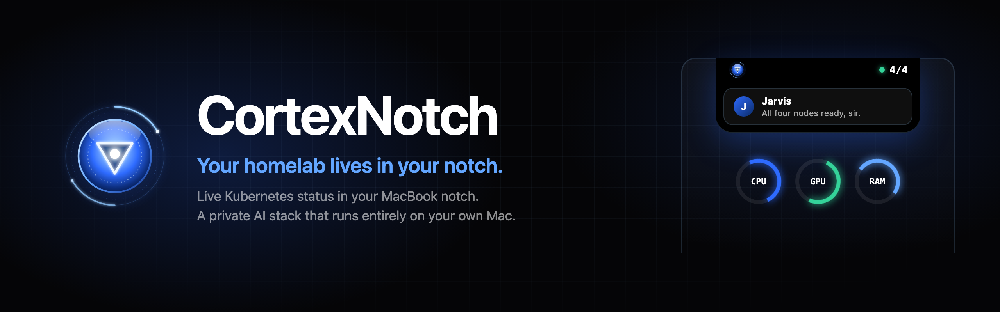

  

  <b>A Dynamic Island for your homelab.</b> 
  Live Kubernetes status in your MacBook notch, and a private AI stack that runs entirely on hardware you already own.

  <a href="https://cortexnotch.com">Website</a> &nbsp;·&nbsp;
  <a href="https://cortexnotch.com/#pricing">Get CortexNotch</a> &nbsp;·&nbsp;
  <a href="mailto:support@cortexnotch.com">Support</a>

---

### Three parts. One machine. All yours.

| | |
|---|---|
| **The notch** | A pitch-black liquid-glass HUD in the MacBook notch: node health, pod status, CPU, GPU, RAM and battery rings, iMessage with quick reply, now playing, and a file shelf. |
| **A real cluster** | A local k3d Kubernetes cluster kept in sync from Git by Flux, the same way production clusters run. |
| **Private Jarvis** | A local LLM on Ollama with a neural voice and on-device speech recognition. No API keys, no rate limits, nothing leaves your Mac. |

**$35 once.** No subscription, no account, no cloud. 30-day money-back guarantee.
